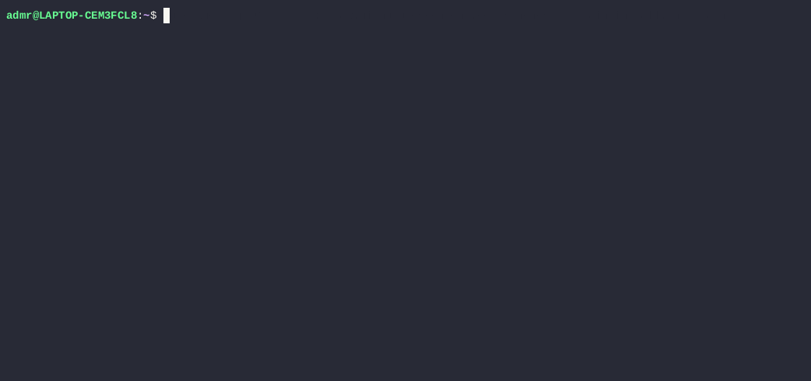

**Вступ: Опис інструментів та їх призначення**

Minikube, Kind та K3d - це інструменти, розроблені для швидкого розгортання та запуску легковагових кластерів Kubernetes на локальній машині розробника. Вони ідеально підходять для навчання, тестування додатків перед відправкою в продакшн, а також для локальної розробки без необхідності використання дорогих хмарних ресурсів.

Основна відмінність полягає в механізмі розгортання: Minikube використовує локальну віртуальну машину (ВМ), тоді як Kind та K3d використовують Docker-контейнери для імітації вузлів кластера.

**Характеристики**

| Характеристика | Minikube | Kind (Kubernetes in Docker) | K3d (K3s in Docker) |
| --- | --- | --- | --- |
| **Механізм роботи** | Віртуальна машина (VirtualBox, KVM, Hyper-V, Docker VM, Podman VM) | Docker-контейнери | Docker-контейнери (на базі K3s) |
| **Підтримувані ОС** | Linux, macOS, Windows | Linux, macOS, Windows | Linux, macOS, Windows |
| **Підтримка архітектур** | x86-64, ARM64 | x86-64, ARM64 | x86-64, ARM64 |
| **Багатоузловий кластер** | Переважно одноузловий (експериментально підтримує HA) | **Так**, повноцінна підтримка | **Так**, повноцінна підтримка |
| **Автоматизація (CI/CD)** | Можлива, але повільніша через ВМ | **Відмінна** (швидкий запуск, чисте середовище) | **Відмінна** (дуже швидкий запуск) |
| **Додаткові функції** | Вбудовані додатки (dashboard, ingress), легке керування драйверами ВМ. | Фокусується на чистому K8s, мінімум додаткових функцій. | Вбудоване керування реєстрами образів, просте налаштування портів. |
| **Керування кластером** | CLI minikube (start, stop, delete, tunnel) + kubectl | CLI kind (create, delete, export logs) + kubectl | CLI k3d (cluster create, delete, list) + kubectl |

**Переваги та недоліки**

| Інструмент | Переваги | Недоліки |
| --- | --- | --- |
| **Minikube** | \+ Найбільш зрілий та перевірений інструмент.   \+ Не потребує Docker (може використовувати інші драйвери ВМ).   \+ Легкий доступ до доповнень (dashboard, metrics-server).   \+ Відмінна документація та підтримка. | \- Повільніший запуск через необхідність підняття ВМ.   \- Вище споживання оперативної пам'яті (потрібна ОС для ВМ).   \- Складніше налаштування мережі, якщо потрібен прямий доступ до сервісів. |
| **Kind** | \+ Використовує Docker - ідеально підходить для CI/CD.   \+ Швидке розгортання багатоузлових кластерів.   \+ Підтримує останні версії Kubernetes дуже швидко.   \+ Відмінно підходить для тестування самого Kubernetes. | \- Потребує встановленого та запущеного Docker.   \- Менш зручний для доступу до сервісів з хост-машини (потрібне прокидання портів).   \- Не має вбудованих додаткових функцій (dashboard потрібно ставити вручну). |
| **K3d** | + **Найшвидший час розгортання** (використовує полегшений K3s).   \+ Найменше споживання ресурсів (легковаговий K3s).   \+ Дуже простий CLI для керування портами та реєстрами.   \+ Ідеально підходить для швидкої локальної розробки. | \- Базується на K3s, який трохи відрізняється від "чистого" K8s (вирізані деякі застарілі функції).   \- Потребує Docker.   \- Менш зрілий, ніж Minikube чи Kind (хоча дуже стабільний). |

**Демонстрація розгортання застосунку «Hello World» на Kubernetes**

**Висновки та рекомендації щодо використання в PoC для стартапу**

Для стартапу, який проводить **Proof of Concept (PoC)** і шукає баланс між простотою використання, швидкістю розгортання та близькістю до реального production-середовища, рекомендації будуть такими:

- **Основна рекомендація - K3d:**
  - **Чому:** K3d забезпечує **найшвидший зворотний зв'язок** для розробників завдяки миттєвому розгортанню та низькому споживанню ресурсів. Для PoC критична швидкість ітерацій, і K3d ідеально підходить для цього. Він достатньо близький до стандартного K8s, щоб бути релевантним.
- **Альтернатива для CI/CD - Kind:**
  - **Чому:** Якщо PoC передбачає активне тестування процесів CI/CD (наприклад, автоматичне розгортання в тестовому кластері після коміту), Kind є галузевим стандартом для таких завдань.
- **Minikube - якщо немає Docker:**
  - **Чому:** Використовуйте Minikube лише в тому випадку, якщо на вашій локальній машині з якихось причин неможливо встановити або використовувати Docker Desktop, але є можливість запустити віртуальну машину. В інших випадках Kind або K3d ефективніші.

Отже, для стартапу найкращим вибором для локальної розробки та PoC є K3d.
