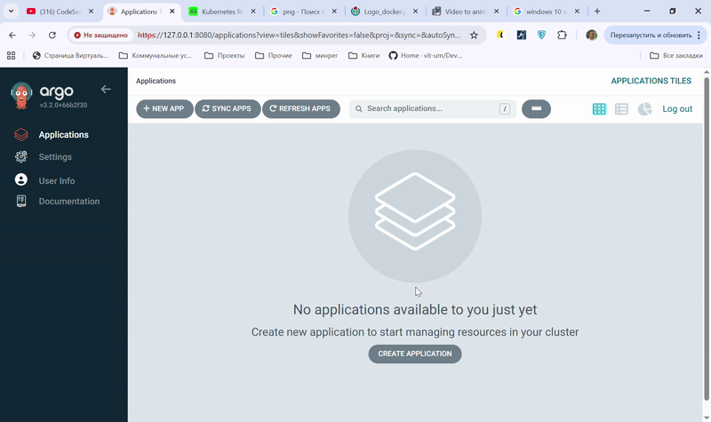
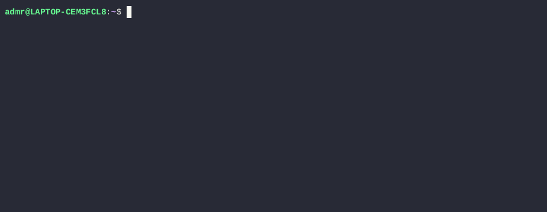

**MVP є мінімальним продуктом з основними функціями**

В застосунку ArgoCD створюємо аплікейшен за посиланням з GIT https://github.com/den-vasyliev/go-demo-app

*Перевіряємо неймспейс*

kubectl get svc -n demo-go

*Проброс порту*

kubectl port-forward -n go-go-demo svc/ambassador 8088:80

**Перевіряємо роботу застосунку AsciiArtify**

*Скачуємо малюнок в форматі *.png*

wget -O /tmp/kub.png https://upload.wikimedia.org/wikipedia/commons/7/71/Logo_docker.png

*Перевіряємо застосунок*

curl -F 'image=@/tmp/kub.png' localhost:8088/img/

**Налаштування роботи автоматичної синхронізації ArgoCD**

