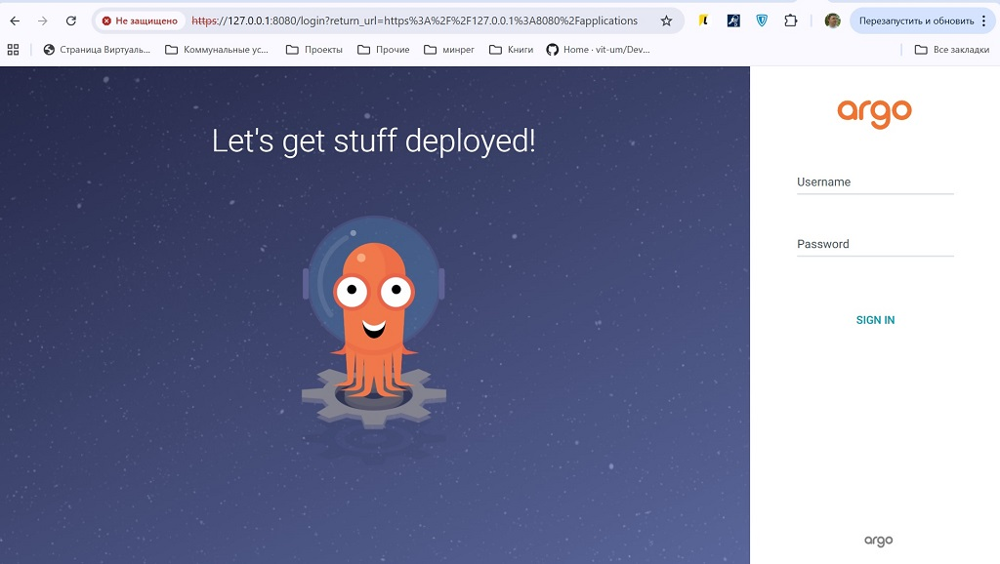
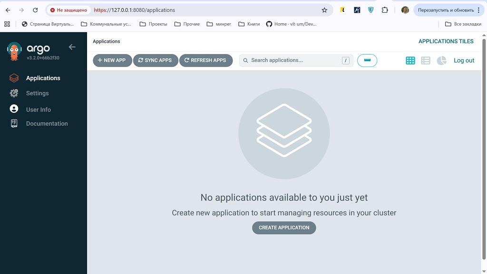

**Створюємо кластер під ARGOCD**

admr@LAPTOP-CEM3FCL8:~$ k3d cluster create argocd

*INFO[0000] Prep: Network                                
INFO[0000] Created network 'k3d-argocd'                 
INFO[0000] Created image volume k3d-argocd-images       
INFO[0000] Starting new tools node...                   
INFO[0000] Starting node 'k3d-argocd-tools'             
INFO[0001] Creating node 'k3d-argocd-server-0'          
INFO[0001] Creating LoadBalancer 'k3d-argocd-serverlb'  
INFO[0001] Using the k3d-tools node to gather environment information 
INFO[0002] HostIP: using network gateway 172.20.0.1 address 
INFO[0002] Starting cluster 'argocd'                    
INFO[0002] Starting servers...                          
INFO[0002] Starting node 'k3d-argocd-server-0'          
INFO[0008] All agents already running.                  
INFO[0008] Starting helpers...                          
INFO[0008] Starting node 'k3d-argocd-serverlb'          
INFO[0014] Injecting records for hostAliases (incl. host.k3d.internal) and for 2 network members into CoreDNS configmap... 
INFO[0017] Cluster 'argocd' created successfully!*      
               
**Статус кластеру**

admr@LAPTOP-CEM3FCL8:~$ kubectl cluster-info

*Kubernetes control plane is running at https://0.0.0.0:39383
CoreDNS is running at https://0.0.0.0:39383/api/v1/namespaces/kube-system/services/kube-dns:dns/proxy
Metrics-server is running at https://0.0.0.0:39383/api/v1/namespaces/kube-system/services/https:metrics-server:https/proxy*

**Створюємо простір для ARGOCD**

admr@LAPTOP-CEM3FCL8:~$ kubectl create namespace argocd

*namespace/argocd created*

**Встановлення ARGOCD**

admr@LAPTOP-CEM3FCL8:~$ kubectl apply -n argocd -f https://raw.githubusercontent.com/argoproj/argo-cd/stable/manifests/install.yaml

admr@LAPTOP-CEM3FCL8:~$ kubectl config set-context --current --namespace=argocd

*Context "k3d-argocd" modified.*

**Перевірка статусу по простору argocd**

admr@LAPTOP-CEM3FCL8:~$ kubectl get all -n argocd

*NAME                                                   READY   STATUS    RESTARTS   AGE
pod/argocd-application-controller-0                    1/1     Running   0          4m18s
pod/argocd-applicationset-controller-5c8d57cb-xqkm9    1/1     Running   0          4m18s
pod/argocd-dex-server-77978c8bbc-dpq8w                 1/1     Running   0          4m18s
pod/argocd-notifications-controller-59db9f4c79-5tws6   1/1     Running   0          4m18s
pod/argocd-redis-c9bdd6f47-b9htg                       1/1     Running   0          4m18s
pod/argocd-repo-server-6c499f5448-lpdmf                1/1     Running   0          4m18s
pod/argocd-server-58b9cbff8d-rlhb6                     1/1     Running   0          4m18s*

*NAME                                              TYPE        CLUSTER-IP      EXTERNAL-IP   PORT(S)                      AGE
service/argocd-applicationset-controller          ClusterIP   10.43.71.254    <none>        7000/TCP,8080/TCP            4m19s
service/argocd-dex-server                         ClusterIP   10.43.180.166   <none>        5556/TCP,5557/TCP,5558/TCP   4m19s
service/argocd-metrics                            ClusterIP   10.43.127.32    <none>        8082/TCP                     4m19s
service/argocd-notifications-controller-metrics   ClusterIP   10.43.40.207    <none>        9001/TCP                     4m19s
service/argocd-redis                              ClusterIP   10.43.101.210   <none>        6379/TCP                     4m18s
service/argocd-repo-server                        ClusterIP   10.43.108.162   <none>        8081/TCP,8084/TCP            4m18s
service/argocd-server                             ClusterIP   10.43.178.41    <none>        80/TCP,443/TCP               4m18s
service/argocd-server-metrics                     ClusterIP   10.43.195.144   <none>        8083/TCP                     4m18s*

*NAME                                               READY   UP-TO-DATE   AVAILABLE   AGE
deployment.apps/argocd-applicationset-controller   1/1     1            1           4m18s
deployment.apps/argocd-dex-server                  1/1     1            1           4m18s
deployment.apps/argocd-notifications-controller    1/1     1            1           4m18s
deployment.apps/argocd-redis                       1/1     1            1           4m18s
deployment.apps/argocd-repo-server                 1/1     1            1           4m18s
deployment.apps/argocd-server                      1/1     1            1           4m18s*

*NAME                                                         DESIRED   CURRENT   READY   AGE
replicaset.apps/argocd-applicationset-controller-5c8d57cb    1         1         1       4m18s
replicaset.apps/argocd-dex-server-77978c8bbc                 1         1         1       4m18s
replicaset.apps/argocd-notifications-controller-59db9f4c79   1         1         1       4m18s
replicaset.apps/argocd-redis-c9bdd6f47                       1         1         1       4m18s
replicaset.apps/argocd-repo-server-6c499f5448                1         1         1       4m18s
replicaset.apps/argocd-server-58b9cbff8d                     1         1         1       4m18s*

*NAME                                             READY   AGE
statefulset.apps/argocd-application-controller   1/1     4m18s*

**Перенаправлення портів**

admr@LAPTOP-CEM3FCL8:~$ kubectl port-forward svc/argocd-server -n argocd 8080:443&

**Перевіряєво в браузері**

**Отримання доступу до ARGOCD**

admr@LAPTOP-CEM3FCL8:~$ kubectl -n argocd get secret argocd-initial-admin-secret -o jsonpath="{.data.password}"

admr@LAPTOP-CEM3FCL8:~$ kubectl -n argocd get secret argocd-initial-admin-secret -o json|base64 -d;echossword}" |base64 -d;echo

rfmChQrd8tOXHA7-

**Логінемось в середину під отриманними кредами**

